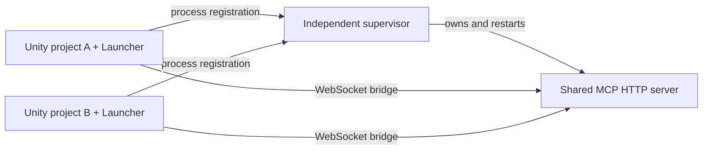

# Lifecycle ownership

The service integration assembly uses a package Version Define and Define Constraint for `com.coplaydev.unity-mcp` versions `[10.3.0,11.0.0)`. Missing or incompatible dependencies exclude that assembly from compilation. The nested `Editor/Setup` assembly has no MCP references or compilation constraint, so its installation window remains available. Its matching Version Define selects the fallback menu only while the integration is excluded, avoiding duplicate menu entries.

An interactive Editor session opens the installation window once when the dependency is unavailable; batch mode suppresses the prompt. VPM and UPM instructions install the same dependency package. Installing a compatible package activates the integration on recompilation without changing project scripting defines. The Launcher UnityPackage also supports this arrangement when MCP for Unity is installed through VPM or UPM.

The dependency-free Setup assembly also provides the shared UI localization table. The integration references Setup, so the main window and installation window use the same language selector even without MCP for Unity. The supported choices are: English, Japanese, Korean, Traditional Chinese, and Simplified Chinese. English text is the lookup key and fallback. Korean appears between Japanese and Traditional Chinese; its persisted value is 4, preserving the existing Chinese preference values 2 and 3. `MCPForUnityLauncher.EditorLanguage` stores the user's choice independently of upstream; absent choices follow the system language, and invalid values fall back to English. A language change repaints open Launcher windows without an assembly reload. All Launcher-authored diagnostic and runtime error messages stay in English and bypass UI localization; paths and original exception details are preserved.

The upstream Editor shutdown handler calls `StopManagedLocalHttpServer`. Its pidfile and instance-token handshake live in user-wide EditorPrefs. Multiple editors therefore read the same handshake despite running different projects. Upstream `StartLocalHttpServer` also tries to stop an existing local server before launching another one.

Launcher installs an `IServerManagementService` decorator through the public `MCPServiceLocator.Register` API immediately on Editor domain initialization. Startup, manual stop, and managed shutdown are intercepted for supervised local lifecycle ownership. Ordinary helpers retain the captured original service implementation. The decorator never resolves itself through the locator when delegating.

The supervisor starts through the existing `uv` runtime using a package-contained Python script copied to a stable user data directory. It is not stopped during Unity assembly reload and is not attached to the first editor's shutdown handshake. Launch arguments reuse `AssetPathUtility` package-source and development-flag helpers; the package is not a second MCP server implementation.

## State and safety boundaries

The per-user state directory is `LocalApplicationData/MCP-For-Unity-Launcher`. Registration files contain editor PID, process creation time, project path, endpoint, and the configured server command. They are same-user local state, not a network command interface. Secrets are not added to status or log messages. Registration and status updates use atomic replacement.

An operating-system file lock prevents concurrent supervisors. A valid registration is based on live process identity, not heartbeat age. Windows uses native process creation FILETIME, Linux reads `/proc` with clock-tick tolerance, and macOS reads the microsecond birth timestamp from `libproc`. On macOS the C# registration writer uses that same native timestamp instead of relying on Mono's start-time precision. Invalid JSON does not immediately discard a previously valid live editor. Shared endpoints with incompatible command sources are reported rather than repeatedly replacing one another.

The server health response must identify itself as MCP for Unity, not merely return HTTP 200. Existing healthy services are marked unowned. Only processes created by the supervisor may be stopped. On Windows, a suspended child is assigned to a private kill-on-close Job Object before it is resumed, which prevents its descendants escaping during shutdown or supervisor failure. Linux and macOS launch a guardian with a pipe held by the supervisor. The guardian starts the server in a private session and cleans up its process group when the pipe closes, including after forced supervisor termination. It keeps the leader unreaped until cleanup so its group identity cannot be reused during the operation. A paused guardian is resumed during owned shutdown; cleanup failure for one service does not block cleanup of the others.

Closing one editor releases only that editor's registration. Disabling management or switching to remote writes a `released: true` registration with the same PID and creation time. This explicitly removes a live registration while missing or malformed files remain tolerated during reloads. A new active registration overwrites that release record when management is reenabled. The last registered editor starts an idle grace period before owned service cleanup. A supervisor crash is detected by surviving editors; the next editor tick may launch a replacement, while the file lock prevents duplicates.

Initial project connection calls the upstream bridge's real WebSocket handshake and retries failures with a delay, without a synchronous TCP reachability gate. It is attempted even if lease writing or supervisor launch fails, allowing an already running service to accept the project. Successful connection is logged, and the status window shows the project's connection and session ID separately from supervisor registration.

Once connected, the upstream WebSocket transport's own reconnect loop remains responsible for transient disconnects. Calling StartAsync every tick would tear down that loop, so the addon avoids doing so. Explicit Stop/ForceStop clears the upstream transport error and cancels its reconnect loop; while management remains enabled, Launcher then reconnects the project. An endpoint change also starts a new connection, and completion for an obsolete endpoint cannot mark the new one connected.

The package is per-project integration. Editors that have only MCP for Unity and do not have Launcher cannot be assumed to publish registrations or use the service decorator. Explicit global discovery is a separate capability.
